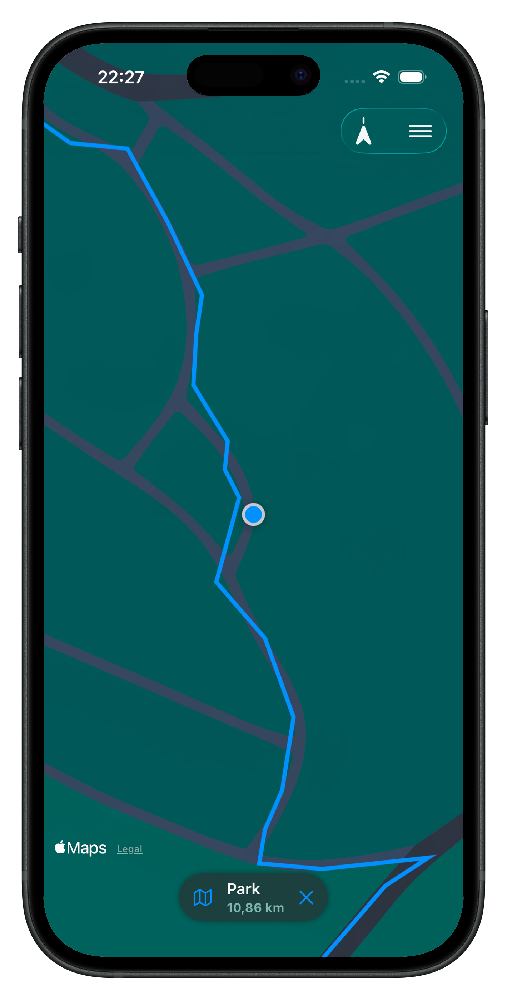
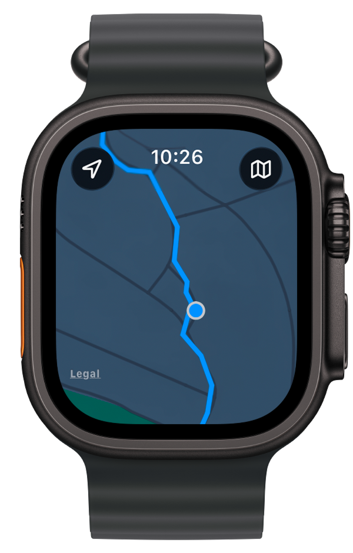

<p align="center">
    
</p>


# WristMap
GPX navigation app for cyclists. Import GPX routes on iPhone and navigate with your iPhone or Apple Watch 

# Screenshots
<p>
    
    
</p>

## Features
- Import GPX routes from files
- Render GPX routes on map
- Live user location with follow mode
- Store routes in a local library
- Send active route to Apple Watch

## Getting started 

### Build from Source
#### Requirements
- Xcode 26 or later 

#### Setup
1. Clone the repo:
```bash 
git clone https://github.com/atomi19/WristMap.git
```


2. Navigate to the project directory:
```bash
cd WristMap
```

3. Open the project in Xcode
```bash
open WristMap.xcodeproj
```

4. Select run destination (iOS or watchOS)
5. Build and run project 

# License
This project is licensed under the [MIT License](LICENSE.txt)
